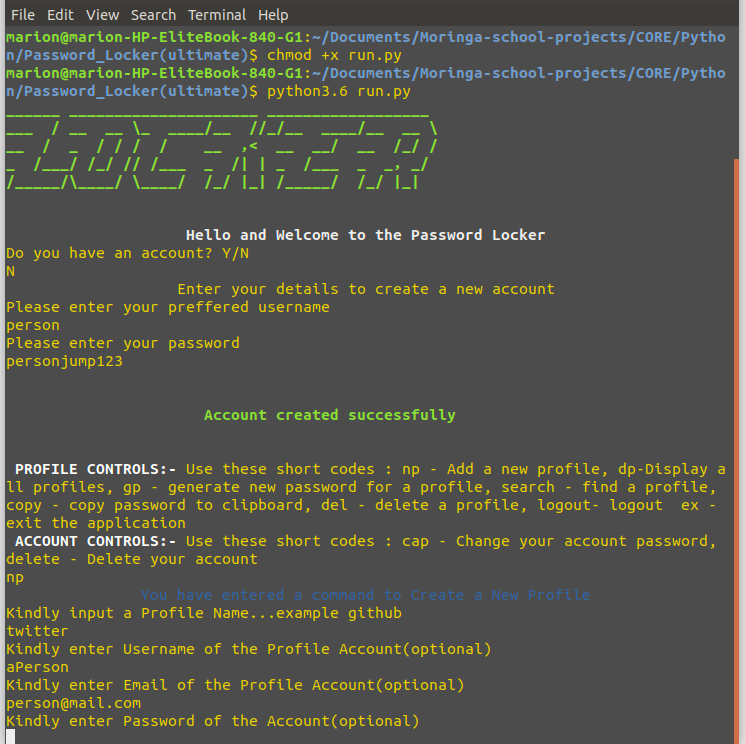

# Password_Locker

## Author

> By **Sarah Marion**

> -----------------------------------------------------------

## Description

> A simple Python Application which runs on the terminal for the purpose of a user to generate strong passwords and store them for various accounts.

## Setup/Installation Requirements

> Clone [This Repository](https://github.com/Sarah-Marion/Password_Locker.git) and run the `run.py`file by executing the following commands:-
> * `chmod +x run.py` then `python3.6 run.py`

## Dependancy Installments

> * pip3 install python3.6
> * pip3 install pyperclip
> * pip3 install pyfiglet
> * pip3 install termcolor
> * pip3 install colorama

## Technical Requirements

* Contains two classes:- User data and Credential data
* Authenticates users to see their credentials
* Contains docstrings to document methods and functions
* Contains a test class for all the classes testing each individual method in a class

## User Stories

> * A user can create an account with details such as login and password
> * A user can generate passwors for a new account
> * Store existing login credentials

## Technologies Used

> * Python3.6
> * pyperclip
> * pyfiglet
> * termcolor
> * colorama

## Specifications

| Behavior        | Input           | Outcome  |
| ------------- |:-------------:| -----:|
| Do you have an account | Yes/No : John   Password : doe | An account is created or not. 
| Create an account | User Name : Sarah   Password : blah | An account is created |
| Display account names | N/A | Display a list of user names for Password Locker accounts | 
| Display a specific users credentials | N/A | List of the user's credentials | 
| Generate a password for a new credential | Account : Any | Generate a password for the user.   Create and save the user's credential with the generated password |
| Copy a password | copy | Password is copied and ready for pasting wherever
| Log out | N/A | Log out of Password Locker account |

## Short code handles

> * np - Create a new password
> * dp - Display all profiles
> * gp - Generate a new password
> * search - Find a profile
> * copy - Copy password to clipboard
> * del - Delete a profile
> * logout - Logout of session

## Known Bugs

> It does not have bugs.But if any problems should occur, email me at devsarahmarion@gmail.com

## Support and Contact Details

> You can reach out to me at devsarahmarion@gmail.com
for Reviews, Advice, Collaborations and Comments

## Licence

> MIT License

> Copyright (c) 2018 **Dev Sarah Marion**

> Permission is hereby granted, free of charge, to any person obtaining a copy
of this software and associated documentation files (the "Software"), to deal
in the Software without restriction, including without limitation the rights
to use, copy, modify, merge, publish, distribute, sublicense, and/or sell
copies of the Software, and to permit persons to whom the Software is
furnished to do so, subject to the following conditions:

> The above copyright notice and this permission notice shall be included in all
copies or substantial portions of the Software.

> THE SOFTWARE IS PROVIDED "AS IS", WITHOUT WARRANTY OF ANY KIND, EXPRESS OR
IMPLIED, INCLUDING BUT NOT LIMITED TO THE WARRANTIES OF MERCHANTABILITY,
FITNESS FOR A PARTICULAR PURPOSE AND NONINFRINGEMENT. IN NO EVENT SHALL THE
AUTHORS OR COPYRIGHT HOLDERS BE LIABLE FOR ANY CLAIM, DAMAGES OR OTHER
LIABILITY, WHETHER IN AN ACTION OF CONTRACT, TORT OR OTHERWISE, ARISING FROM,
OUT OF OR IN CONNECTION WITH THE SOFTWARE OR THE USE OR OTHER DEALINGS IN THE
SOFTWARE.

> --------------------------------------------------------
